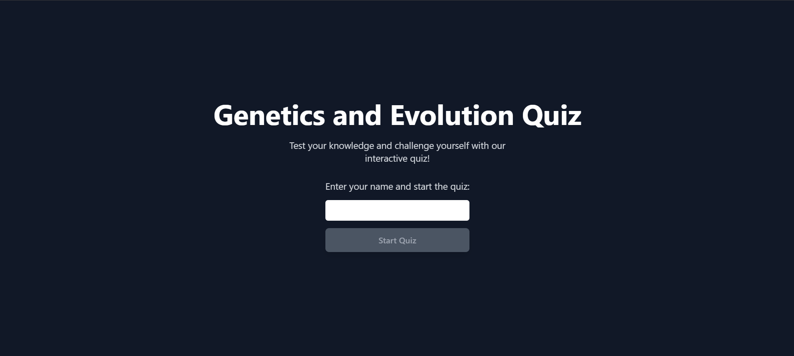
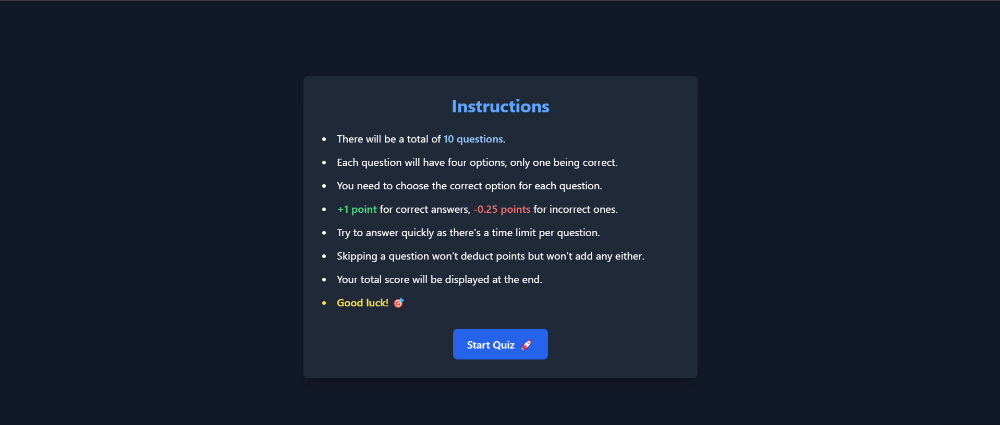
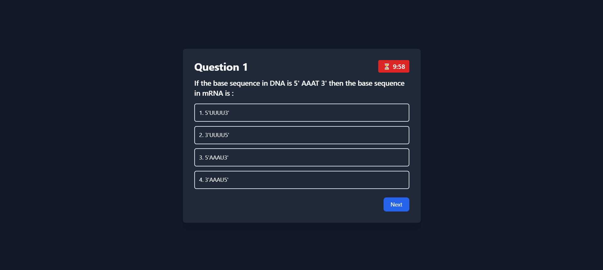
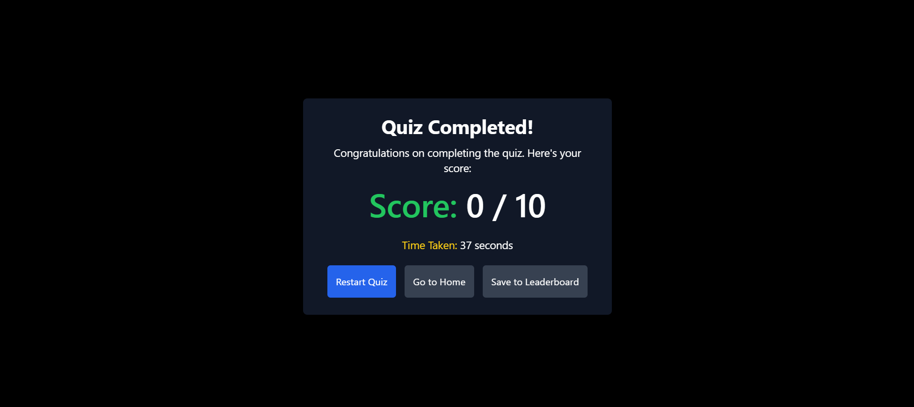
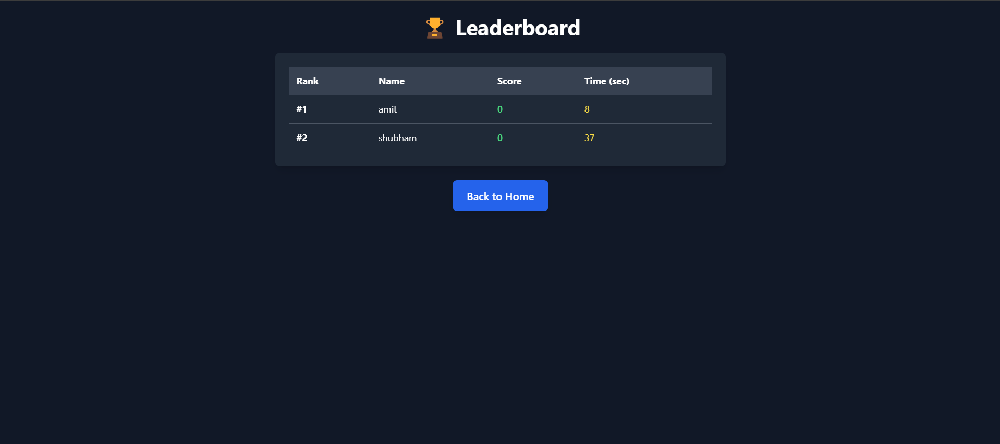

# Quiz Application
A fun and interactive quiz application where users can test their knowledge. This quiz features a scoring system, a leaderboard and a dynamic and interactive user interface.

## Features
1. **Quiz Flow:** Users enter their name, read instructions, and take the quiz. The application tracks the score and time.
2. **Time Limit:** There is a time limit for the whole quiz and users must complete the quiz within that time limit. If not completed within the specified limit, quiz will get automatically submitted.
3. **Leaderboard:** The leaderboard displays the top scorers based on points, with time taken for each quiz.
4. **Animations:** Use of GSAP for interactive animations.
5. **Responsive Design:** The application is fully responsive and works on all devices.

## Tech Stack
1. **React:** The front-end framework used to build the application.
2. **GSAP:** For smooth animations and transitions.
3. **Tailwind CSS:** Utility-first CSS framework for fast styling.
4. **React Router:** For handling navigation between pages.
5. **Axios:** To fetch quiz data from an external API.
6. **SessionStorage and LocalStorage:** To manage user session and leaderboard data.
   
## Folder Structure
- /src
  - /Components
    - ProtectedRoute.js
  - /Context
    - QuizContext.js
  - /Pages
    - HomePage.js
    - InstructionsPage.js
    - QuizPage.js
    - ResultPage.js
    - LeaderBoardPage.js
  - App.js
  - main.js

## Setup & Installation
To get the application running on your local machine, follow these steps: 
1. **Clone the repository.**
```
git clone <repository-url>
cd quiz
```
2. **Install dependencies.**
```
npm install
```
3. **Run the development server.**
```
npm run dev
```

## Page Overview
1. **Home Page:** The home page where users can enter their name and start the quiz.
2. **Instructions Page:** Here the user is given instructions. After reading the instructions the user can start the quiz.
3. **Quiz Page:** The quiz page where the user is presented with questions and has to answer them within the time allotted.
4. **Result Page:** After completing the quiz, the user is shown their score and time taken. Here the user can choose to restart the quiz, or go back to homepage or save information for the leaderboard.
5. **Leaderboard Page:** Displays the top scorers along with their score and time taken. This page is updated when users choose to submit their results to the leaderboard.


## Snapshots
1. **Home Page:** 
2. **Instructions Page:** 
3. **Quiz Page:** 
4. **Results Page:** 
5. **Leaderboard Page:** 

## Demo Video
[Watch the demo](https://drive.google.com/file/d/1M25S0lDVSwZhO3w04dxynuKFgN1--Kr3/view?usp=sharing)